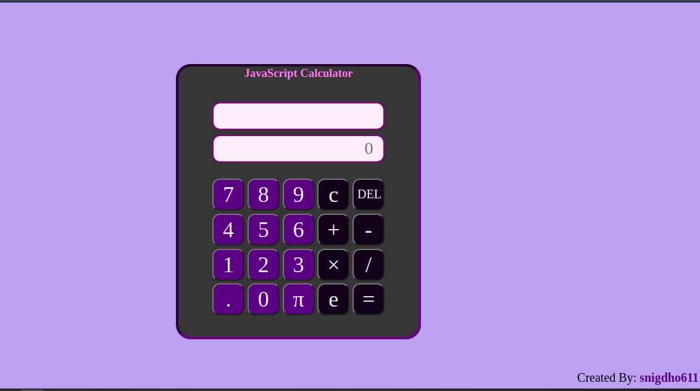

<h1>Vanilla JavaScript Calculator</h1>

For those of you who are trying to enter the realm of developing the web, here is a simple JavaScript project I have decided to share from back in my earliest days. In a sense, this is my first project with JavaScript, so it does have its fair share of issues. However, you will find that the project has:

<ul>
    <li>Structured HTML Markup</li>
    <li>CSS with classes and id selectors</li>
    <li>JavaScript with functions, variables and event handlers</li>
</ul>
<h4>Here is a screenshot for some idea</h4>
